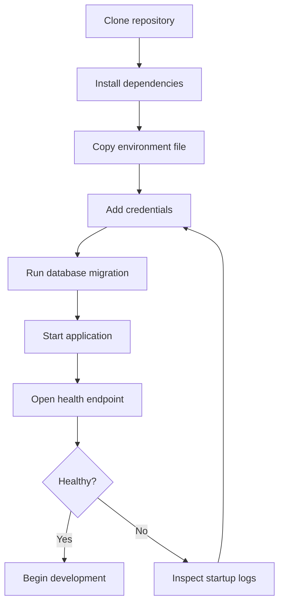

# Before and after: repository documentation readability

These fictional examples show how to apply the guide without changing technical meaning.

They are transformations, not templates. The useful lesson is **why** the representation changes.

For the underlying guidance, see [GUIDE.md](../GUIDE.md).

## Example 1: turn a wall of text into a reading path

### Before

> Data Relay imports vendor CSV files into the analytics warehouse and before using it you need Python 3.12 and credentials in the environment and the input file must contain vendor_id, recorded_at, and amount columns, then you run python -m relay.import_file followed by the path and the command validates the file and writes accepted rows, but invalid rows are not written and are instead recorded in reports/rejected.csv and the process exits with status 2 when any rejected rows exist, and if the file passes completely it exits with status 0, and the import is idempotent based on vendor_id plus recorded_at so rerunning the same file will not duplicate accepted rows.

The paragraph is technically dense but forces the reader to extract prerequisites, schema, procedure, behavior, and exit semantics from one block.

### After

#### Import a vendor export

Data Relay validates a vendor CSV before writing accepted rows to the analytics warehouse. Imports are idempotent on the pair `vendor_id + recorded_at`, so rerunning the same file does not duplicate accepted rows.

**Prerequisites**

- Python 3.12
- warehouse credentials in the environment
- a CSV containing the required columns below

| Required column | Meaning |
| --- | --- |
| `vendor_id` | Vendor identifier |
| `recorded_at` | Source timestamp |
| `amount` | Imported amount |

**Run the import**

1. Execute:

   ```powershell
   python -m relay.import_file .\data\vendor.csv
   ```

2. Check the exit status.
3. If rows were rejected, inspect `reports/rejected.csv`.

| Result | Exit status | Effect |
| --- | ---: | --- |
| All rows accepted | `0` | Accepted rows are written |
| One or more rows rejected | `2` | Accepted rows are written; rejected rows are reported |

### Why the after version is easier to use

The technical behavior is unchanged. The presentation now separates:

- orientation: what the command does;
- prerequisites: what must be true first;
- procedure: what the reader should do;
- reference: required columns and exit behavior.

The reader can scan for one question without rereading the entire explanation.

## Example 2: replace a diagram that does not need to be a diagram

### Before

A mostly linear setup procedure is expressed as a large flowchart:



The diagram mixes a seven-step linear procedure with one small troubleshooting branch. Most of the visual structure adds no information beyond sequence.

### After

#### Start the application

1. Clone the repository.
2. Install dependencies.
3. Copy the environment file.
4. Add the required credentials.
5. Run the database migration.
6. Start the application.
7. Open the health endpoint.

If the health check passes, begin development. If it fails, inspect the startup logs, correct the environment or credentials, and retry.

### Why the after version is easier to use

A numbered list exposes the order more directly, is easier to copy into a checklist, and requires less horizontal or visual parsing on a phone.

The branch is simple enough to explain in one sentence. If troubleshooting later develops several distinct paths, a small decision diagram may become useful at that point.

## What these examples demonstrate

A readability refactor should not ask, "How can I make this more visual?"

It should ask:

1. What question is the reader trying to answer?
2. Which information is explanation, procedure, reference, or relationship?
3. What is the simplest representation that preserves the technical truth?
4. Can the reader find the answer quickly on both a narrow and a wide screen?
